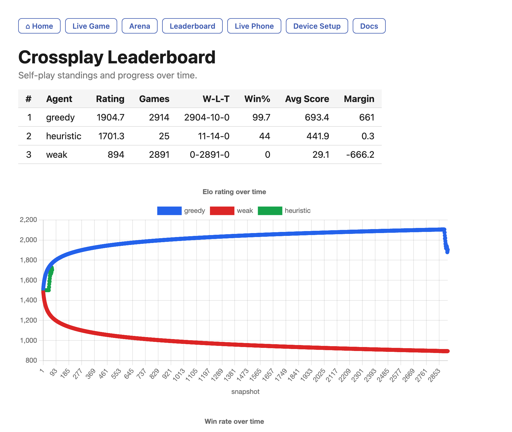
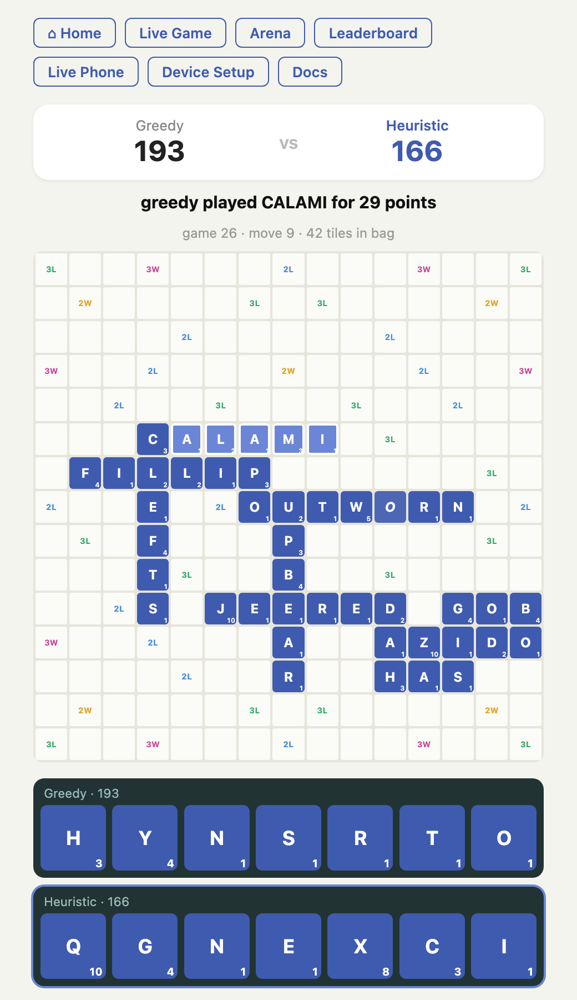
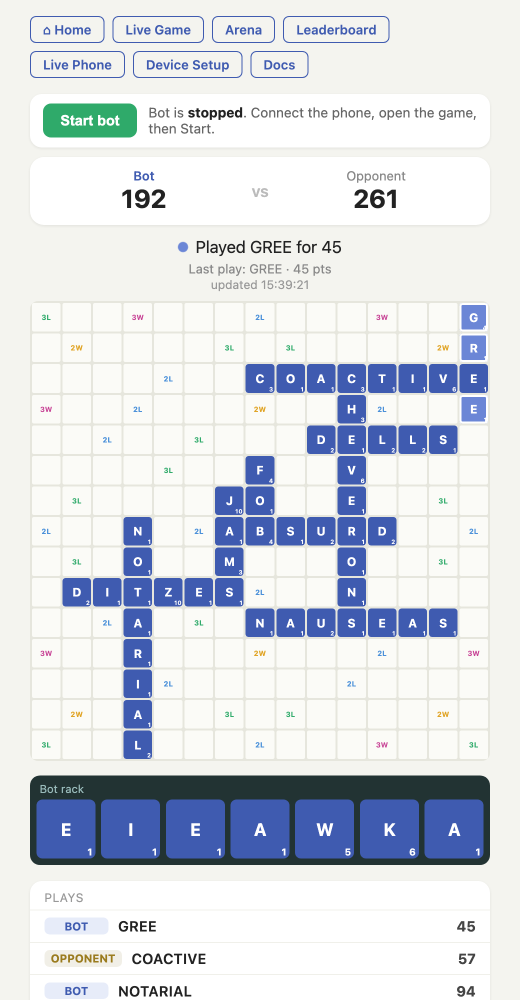

# Crossplay Agent

A sandbox for **building and comparing word-game playing algorithms**. Write a
strategy, watch it play, race it head-to-head against other strategies on a
leaderboard, and — optionally — let it drive a real game on a phone.

The interesting part is the **algorithm** that chooses moves. Everything else (a
headless simulator, a live spectator, an arena, an Elo leaderboard, and the phone
automation) exists to help you develop that algorithm and prove it's good. You can
do almost all of the work with **no phone at all**.

> ### Purpose & responsible use
> This project is for **experimenting with game-playing algorithms** — move
> generation, board evaluation, rack-leave heuristics, self-play training. It is
> **not** intended to be used to cheat at CrossPlay or to gain an advantage over
> real opponents in live play. Automating the real app very likely violates the
> game's Terms of Service (see [below](#a-note-on-playing-the-real-app)). Use the
> live-device feature responsibly and at your own risk.

---

## What it looks like

**Leaderboard** — Elo ratings, win/loss records, and progress charts across
thousands of self-play games:



**Live simulated game** — watch any two algorithms play move-by-move on an
app-styled board:



**Live phone game** — mirror a real game on a connected phone, with scores, a
running play list, and start/stop control:



## Quick start

```bash
python3 -m venv .venv && source .venv/bin/activate
pip install -r requirements.txt
python -m pytest -q                 # sanity check (no device needed)
python tools/dashboard.py           # then open http://localhost:8765
```

You must supply your own **NWL2023** word list at `data/dictionary/nwl23.txt`
(it's copyrighted and not distributed here; the app falls back to a tiny bundled
sample if it's missing). Full details in the guides below.

## Documentation

The dashboard renders these in the browser at **/docs**, or read them here:

- **[Getting Started](docs/getting-started.md)** — install, the dictionary, running
  the dashboard, how the arena and leaderboard work together, device setup, and the
  development loop.
- **[Adding an Algorithm](docs/adding-an-algorithm.md)** — the `Agent` contract,
  the `agents.json → registry → class` chain, and a worked example.
- **[Device abstraction — design](docs/architecture/device-abstraction.md)**,
  **[iOS setup](docs/architecture/ios-setup.md)**, and
  **[Android setup](docs/architecture/android-setup.md)**.

## How it fits together

```
crossplay/strategy/    the algorithms you write (greedy, heuristic, weak, …)
crossplay/engine/      board, scoring, dictionary, legal-move generation
crossplay/web/         the arena / spectator game loop
crossplay/client/      device backends — android · ios · sim (headless)
tools/dashboard.py     one web server tying it all together
data/agents.json       named algorithm profiles (type + tunable params)
data/leaderboard.json  Elo standings + head-to-head records
```

The intended workflow: **propose** an algorithm → **test** it in the arena against
the leaderboard leader (usually `greedy`) → **tweak** params/logic until it wins
consistently → optionally **prove it live** on a device.

## A note on playing the real app

CrossPlay is a published app with its own Terms of Service, which generally
prohibit automated/bot access and anything that confers an unfair advantage.
Pointing this bot at the live app to play against real opponents is very likely a
violation of those terms. This repository is intended for **algorithm research and
self-play**; the device backends exist to validate that a strategy works against
the real board's perception/input, not to cheat. Review the applicable Terms of
Service and use your judgment — responsibility for how you use it is yours.

*Not legal advice.*
